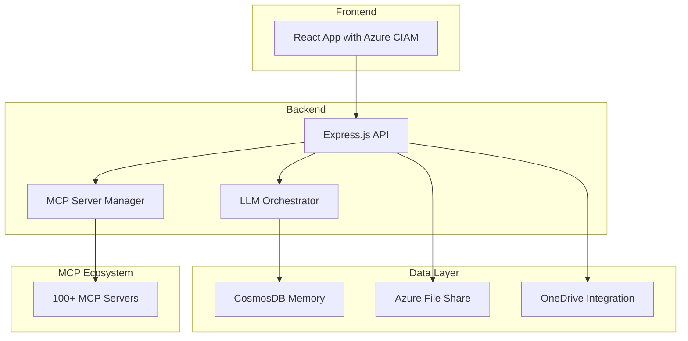

# ai-mcp-system
Reusable AI system with React frontend, Azure B2C auth, CosmosDB memory, and 100+ MCP server integrations

# AI MCP System

A comprehensive AI system featuring React frontend, Azure B2C authentication, CosmosDB memory storage, and integration with 100+ Model Context Protocol (MCP) servers.


## Features

- 🔐 **Microsoft Entra External ID (CIAM) OAuth 2.0 Authentication** - Modern, secure, and enterprise-ready user management
- 🧠 **Multi-LLM Orchestration** - Sequential thinking with OpenAI + Anthropic
- 💾 **Persistent Memory** - CosmosDB-backed conversation history
- 🛠 **100+ MCP Servers** - Extensive tool ecosystem integration
- 📁 **File Processing** - OneDrive, Azure File Share, multimodal support
- 🔍 **Web Search** - Brave Search integration
- 🔗 **Service Integration** - GitHub, Slack, Gmail, Notion, and more

## Architecture



---

## Getting Started

### Prerequisites
- Node.js (v16+ recommended)
- npm or yarn
- Azure account (for CIAM and CosmosDB)

### Installation

1. **Clone the repository:**
   ```bash
   git clone https://github.com/your-org/ai-mcp-system.git
   cd ai-mcp-system
   ```
2. **Install backend dependencies:**
   ```bash
   cd backend
   npm install
   # or
   yarn install
   ```
3. **Install frontend dependencies:**
   ```bash
   cd ../frontend
   npm install
   # or
   yarn install
   ```

### Running the Application

- **Backend:**
  ```bash
  cd backend
  npm start
  ```
- **Frontend:**
  ```bash
  cd frontend
  npm start
  ```

---

## Configuration

- Copy `.env.example` to `.env` in both `backend` and `frontend` directories and fill in required values.
- Set up Azure CIAM and CosmosDB resources as per your Azure portal.
- Configure MCP server endpoints in the backend as needed.

---

## Usage

- Access the frontend at `http://localhost:3000` (default).
- Sign in using Microsoft Entra External ID (CIAM) OAuth 2.0.
- Interact with LLMs, manage files, and use integrated MCP tools.
- Conversation history is stored in CosmosDB.

---

## Contributing

1. Fork the repository
2. Create a new branch (`git checkout -b feature/your-feature`)
3. Commit your changes (`git commit -am 'Add new feature'`)
4. Push to the branch (`git push origin feature/your-feature`)
5. Open a pull request

Please follow the code style and add tests where possible.

---

## License

This project is licensed under the MIT License. See the [LICENSE](LICENSE) file for details.

---

## Contact

For questions or support, please open an issue or contact the maintainers at [your-email@example.com].

---

## Authentication Overview

This system uses Microsoft Entra External ID (CIAM) with OAuth 2.0 for authentication:

- **Frontend:** Users sign in via Microsoft Entra CIAM, using a secure OAuth 2.0 flow. The React app uses MSAL.js to handle login, token acquisition, and session management.
- **Backend:** Azure Functions validate the JWT access tokens issued by Entra CIAM, ensuring only authenticated users can access protected APIs.

This approach provides robust security, seamless SSO, and is ready for enterprise-scale deployments.
